## Macros:

- Macros tracker app made entirely with kotlin following MVVM arch and using XML for the UI part.

- The app local storage is built with Room and Proto Datastore for the user related data, and retrieves data from API with Retrofit.

- The dependency injection is managed with Hilt in order to inject the required data into the repositories

- The app uses Flow with Coroutines to represent the data into the UI.

- The App also supports Barcode Scanning via Android ML Kit & open food facts API

## Screenshots:
|  User Info Screen  |   Set Units Dialog   | Set User Data DropDown Dialog |
| :----------------------: | :----------------------: | :-----------------------: |
| 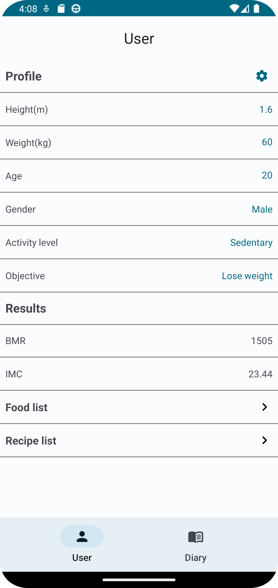 | 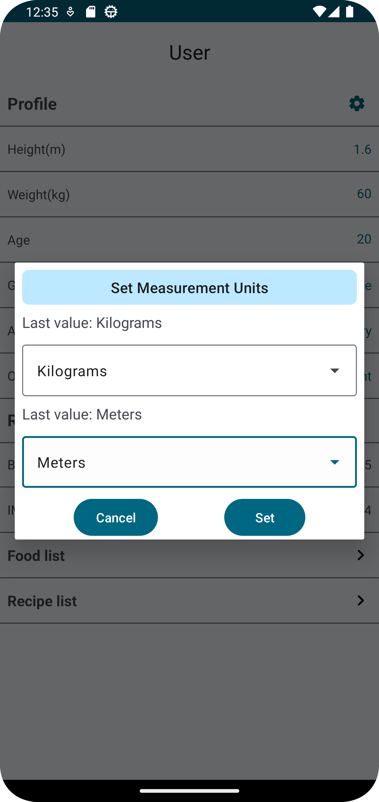 | 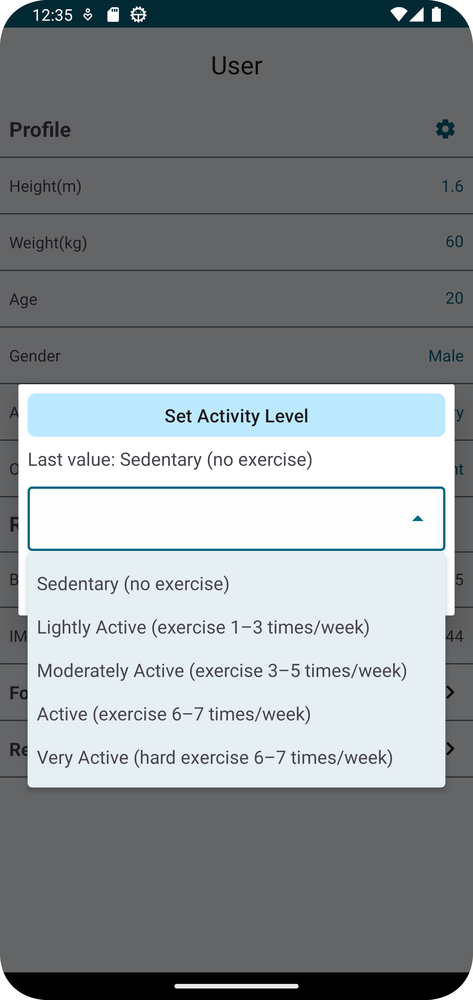  |

|  Set User Data Dialog  |   User Food List   | User Recipe list |
| :----------------------: | :----------------------: | :-----------------------: |
| 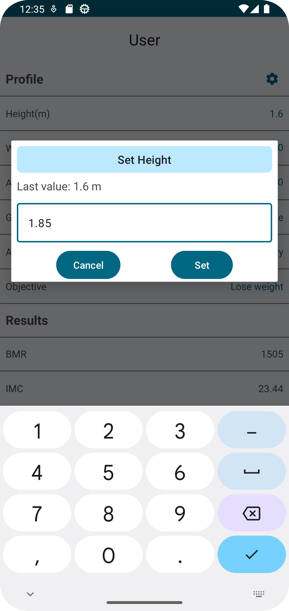 | 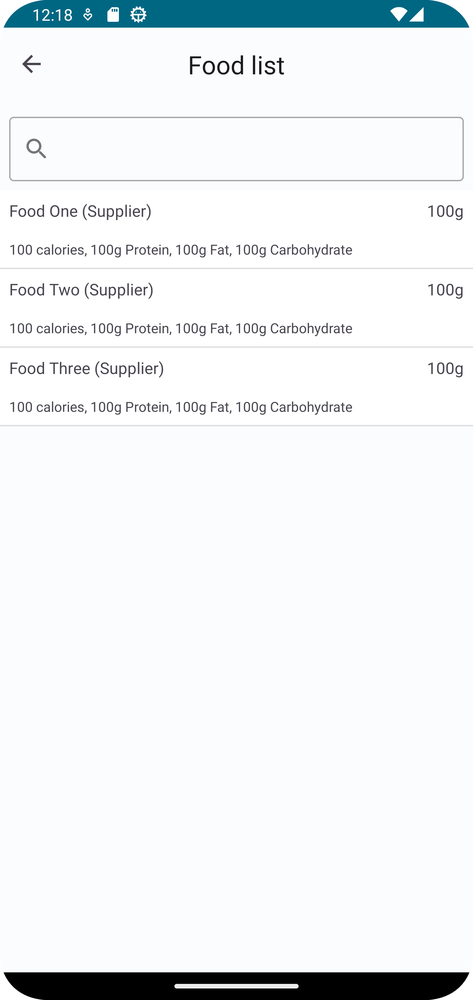 | 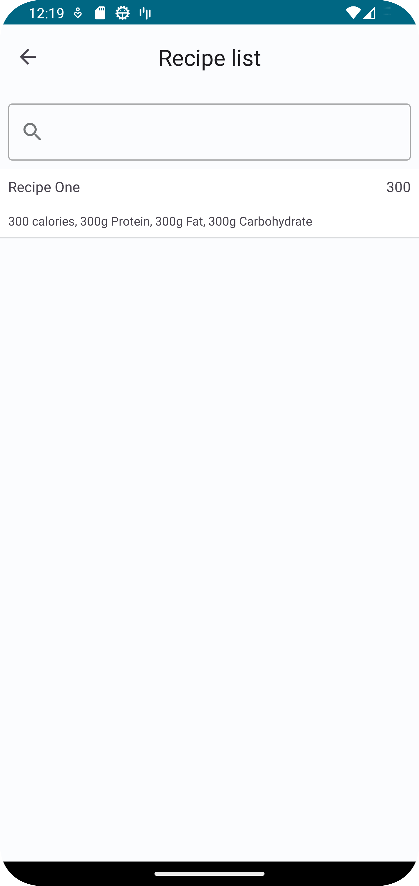  |

|     Diary Screen     |    Diary Meals Screen   |      MyFoods Screen     |
| :----------------------------: | :----------------------------: | :----------------------------: |
| 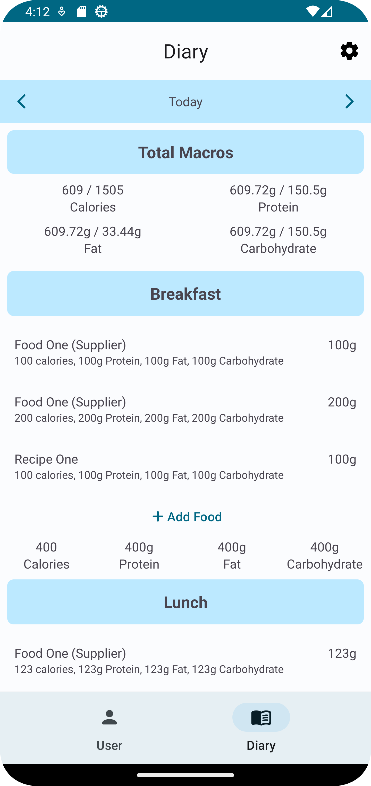 | 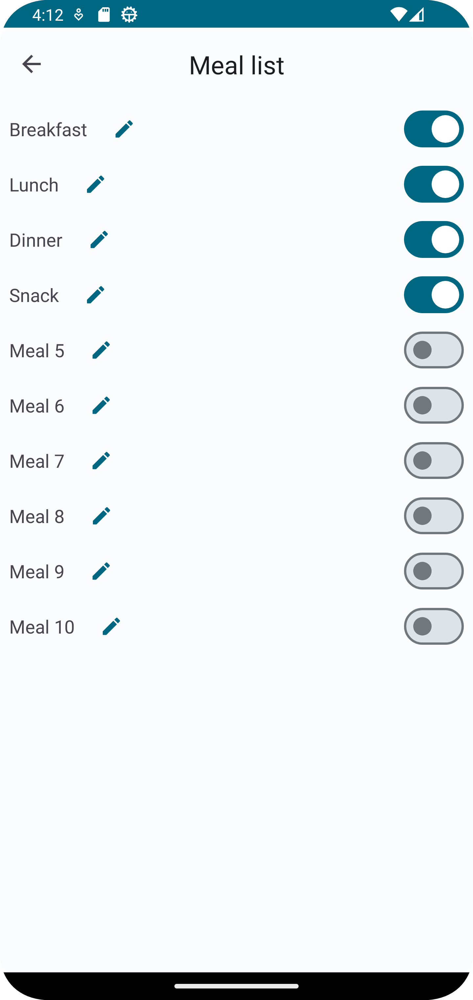 | 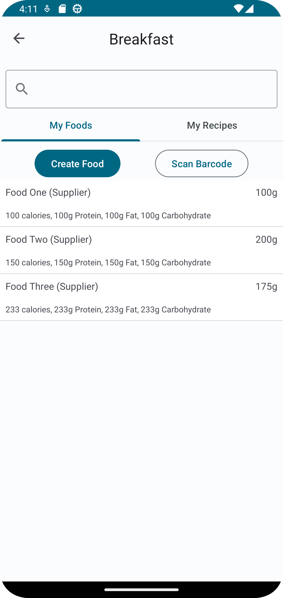 |

|        MyRecipeList Screen       |    Create Food Screen    |    Create Recipe 1   |
| :-----------------------: | :-----------------------: | :-----------------------: |
| 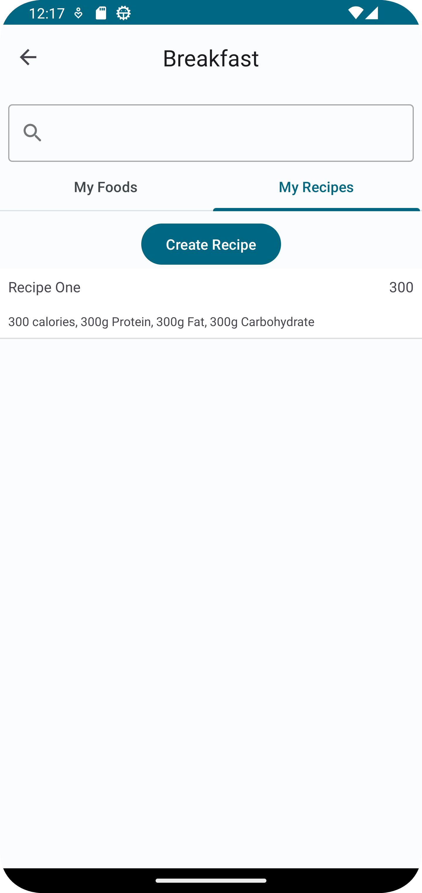 | 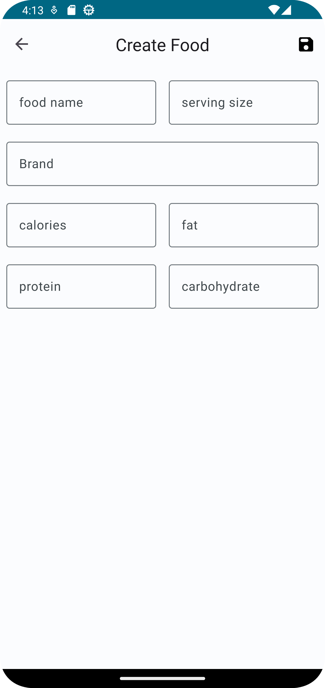 | 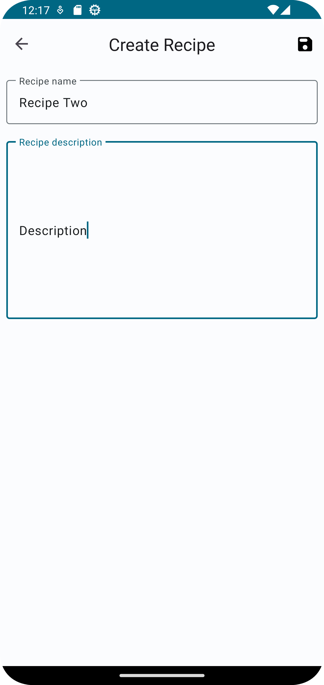 |

|    Create Recipe 2     |    Create Recipe 3     |     Barcode Scanner       |
| :--------------------------: | :--------------------------: | :--------------------------: |
| 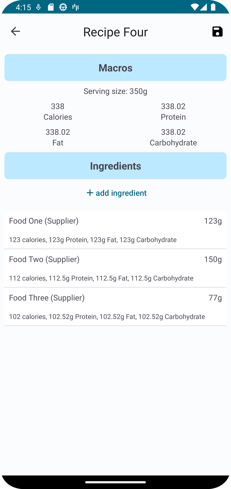 | 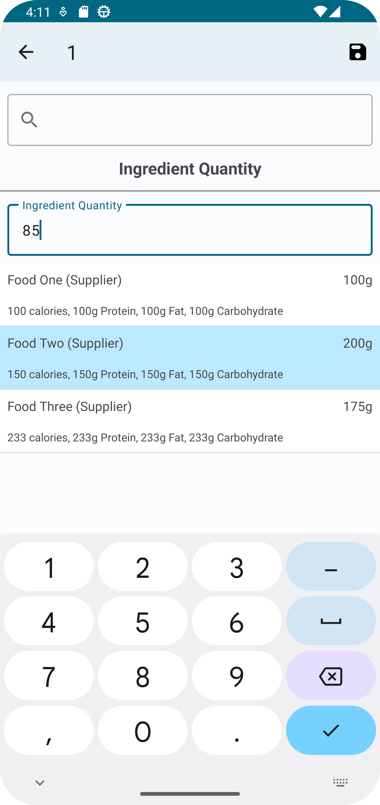 | 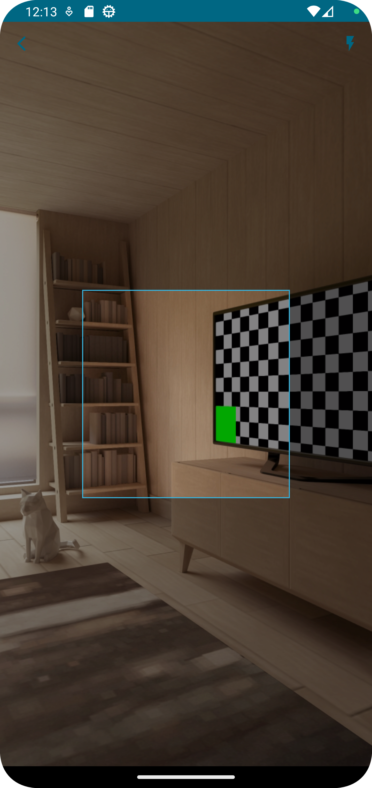 |

